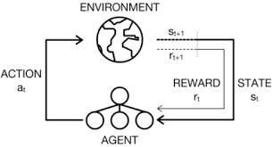

[//]: # (Image References)

[image1]: https://user-images.githubusercontent.com/10624937/42135619-d90f2f28-7d12-11e8-8823-82b970a54d7e.gif "Trained Agent"

# Udacity DRLND Project 1: Navigation

### Environment description

In this project, we are challenged to train an agent to navigate (and collect bananas!) in a large, square world.

![Trained Agent][image1]

The agent is a process/program/algorithm that interact with the environment using the state is in and using a set of action allowed by the environment. In return the environment will provide a reward and a new state resulting of the action taken. The agent goal is to maximize the rewards over time.

The state provided by the environment is a vector of 37 values. It contains the agent's velocity, plus ray-based perception of objects around agent's forward direction.

A reward of +1 is provided for collecting a yellow banana, and a reward of -1 is provided for collecting a blue banana.
Thus, the goal of the agent is to collect as many yellow bananas as possible while avoiding blue bananas.

Given this information, the agent has to learn how to best select actions.
Four discrete actions are available, corresponding to:
- **`0`** - move forward.
- **`1`** - move backward.
- **`2`** - turn left.
- **`3`** - turn right.

The task is episodic, and in order to solve the environment, the agent must get an average score of +13 over 100 consecutive episodes.

### Getting Started

1. Download the environment from one of the links below.  You need only select the environment that matches your operating system:
    - Linux: [click here](https://s3-us-west-1.amazonaws.com/udacity-drlnd/P1/Banana/Banana_Linux.zip)
    - Mac OSX: [click here](https://s3-us-west-1.amazonaws.com/udacity-drlnd/P1/Banana/Banana.app.zip)
    - Windows (32-bit): [click here](https://s3-us-west-1.amazonaws.com/udacity-drlnd/P1/Banana/Banana_Windows_x86.zip)
    - Windows (64-bit): [click here](https://s3-us-west-1.amazonaws.com/udacity-drlnd/P1/Banana/Banana_Windows_x86_64.zip)
    
2. Place the file in this GitHub repository folder, and unzip (or decompress) the file. 

3. Make sure that you have the following python module installed
	- numpy
	- matplotlib
	- torch
	- [Unity ML-agents](https://github.com/Unity-Technologies/ml-agents/blob/master/docs/Installation.md)

### Instructions

Follow the instructions in `Navigation.ipynb` to get started with training your own agent or to see an already trained agent.
If you want to more about the algorithm selected look at the `report.md` file from this repository

You can watch this [video](https://youtu.be/4iKkFJIcWsY)  to see the agent trained in action.