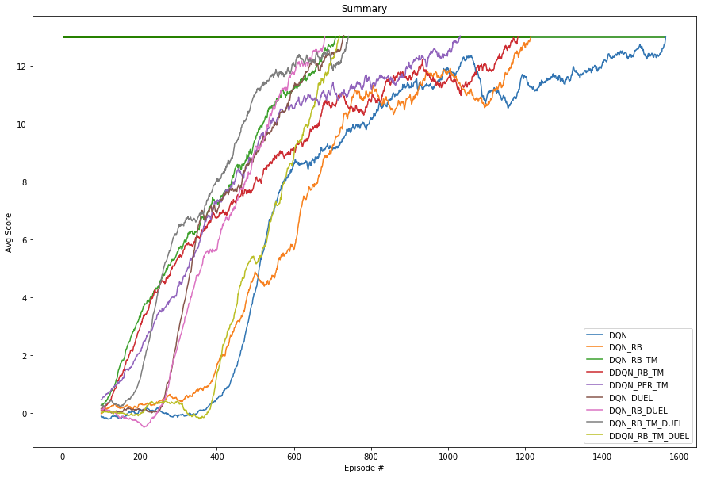
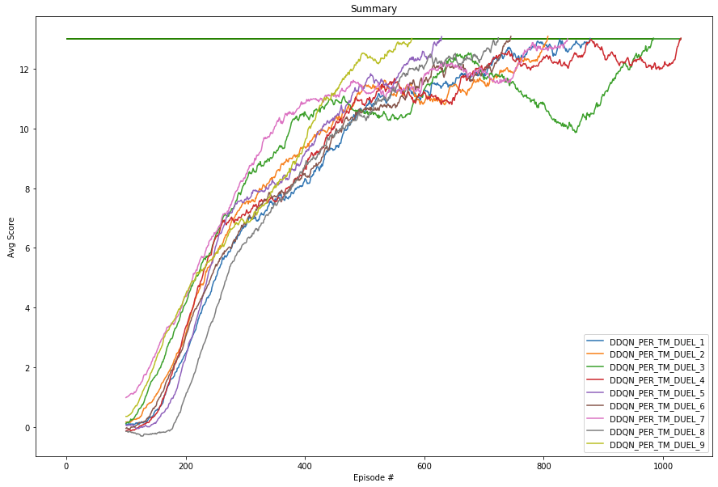
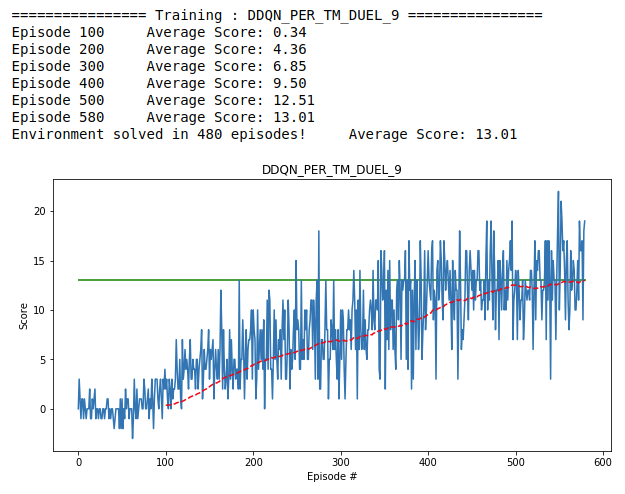

# Implementation

### Introduction
We will describe the approach taken to solve the environment using Deep Reinforcement Learning.

I wanted to test some of the possible improvement effect on a DQN. So the agent class can be configured to activate or not those improvements.

I test a set of configuration to see which one worked the best for this environment. It turns out that it is a DDQN using Dueling network with Prioritized Replay Buffer.


### Learning Algorithm

The Agent class defined in `dqn_agent.py` is configurable to select different improvement over a simple DQN architecture using the boolean parameters `use_*`

```python
    def __init__(self, state_size, action_size, seed=0, gamma=0.99, learning_rate = 5e-4,
                       use_RB=True, RB_size=int(1e5), RB_batch_size=64,
                       use_TM=True, TM_update_every=4, use_DDQN=True,
                       use_PER=False, PER_epsilon=0.01, PER_alpha=0.5, PER_beta=0.4, PER_beta_increment=0.001,
                       use_DUELING=True):
        """Initialize an Agent object.
        
        Params
        ======
            state_size                  (int)   : dimension of each state
            action_size                 (int)   : dimension of each action
            seed                        (int)   : random seed
            gamma                       (float) : discount factor
            learning_rate               (float) : learning rate of the model

            use_RB                      (bool)  : Use a replay buffer
            RB_size                     (int)   : replay buffer size
            RB_batch_size               (int)   : minibatch size of the learning

            use_TM                      (bool)  : Use a target model
            TM_update_every             (int)   : update target model every t steps

            use_DDQN                    (bool)  : Use Double DQN, only valid if use target model
            
            use_PER                     (bool)  : Use a prioritized replay buffer
            PER_epsilon                 (float) : Small value added to priorities to avoid zero probabilities
            PER_alpha                   (float) : Power used to compute the sampling probabilities
                                                  [0-1] : 0=> Uniform sampling 1=>Fully prioritized
            PER_beta                    (float) : Used in importance-sampling - Initial value increased to 1
            PER_beta_increment          (float) : To increment beta at each sampling

            use_DUELING                 (bool)  : Use DUELING network
        """
```

The agent has 2 behaviors `act()` and `step()`.

#### Agent act()

It is used to select an appropriate action based on the current state. It uses an epsilon greedy policy to either select with epsilon probability an action uniformaly or with (1-epsilon) probability the greedy action of the policy network.

#### Agent step()

This is where all the learning happens, this function has 2 objectives.

- Save the current experience
The current experience is saved differently depending on the configuration.

	- `use_RB=False and use_PER=False` The tuple `(state, action, reward, next_state, done)` is directly used for the learning.
	- `use_RB=True and use_PER=False` The tuple `(state, action, reward, next_state, done)` is saved in a replay buffer.
	- `use_RB=True and use_PER=True` The tuple `(state, action, reward, next_state, done)` along side with the TD error computed using the current experience is saved in a Prioritized Replay Buffer.
	
- Decide if we need to learn and optimize our network

	- `use_RB=False` If no replay buffer, do a learning step each time step with the current experience
	- `use_RB=True` If we use a Basic Replay Buffer or a Prioritized one we do learn only if enough sample in the replay buffer
	
##### Learning

The learning is divided in 4 steps

1. Experience batch sampling
2. Compute Action values of the current step and the target one based on the current reward.
3. Compute the loss and do one network optimization step
4. Update target network if need be

	- Batch sampling
	
		- No Replay Buffer: use a batch of size 1 with the current experience
		- Simple Replay Buffer : sample a bacth of size `RB_batch_size` uniformaly from the replay buffer. Implementation available in `ReplayBuffer.py`.
		- Prioritized Replay Buffer: sample a batch of size `RB_batch_size` using the priority stored with the experience. The priority is stored as `(abs(TD_error) + epsilon)^alpha`. Epsilon is used to avoid a zero priority so any experience has a change to be sampled. Alpha is used to trade off between uniform sampling when it is zero and fully prioritized when it is one. With the priority stored we can compute a sampling probability using the formula . The implementation is available in `ReplayBufferPER.py` and use a cumulative sum binary tree to keep the priorities and to be able to sample fast enough, explanation available [here](https://jaromiru.com/2016/11/07/lets-make-a-dqn-double-learning-and-prioritized-experience-replay/). Also we need to adjust the weights as we are not doing an uniform sampling anymore, so we generate the importance sampling weigths using the formula 
		
	- Action values
		- Compute the expected value `Q_expected` using the policy network and the current state
		- Compute the target value `Q_target` using the current reward and the greedy action value for next state. We also use the discount factor to take into account that the future rewards are not certain. So we uset the formula : . The Q_value for the next state is computed differently depending on the configuration
			- `use_TM=False` No target model, we use the policy nextwork and take the max value across actions. 
			- `use_TM=True and use_DDQN=False` Use a target model but not the DDQN improvement. In that case we use a target model identical to the policy network but with the weights updates less frequently, it has been shown that it improves the learning process. So we use the target network and that max value across actions. 
			- `use_TM=True and use_DDQN=True` Use a target model with DDQN improvement. We use the target model to get the action values and use the policy network to get the action to choose. 

	- Loss and network optimization
	The network is build using `pytorch` framework, so we use directly the functionality of the framework by using the mean square error loss `mse_loss(Q_expected, Q_target)` and we minimize the loss using the `Adam` optimizer and the learning rate from the configuration.
	if we use the Prioritized Replay Buffer, we do need to adjust the values before doing one optimization step. Iuse the Importance Sampling weitghts from PER to reduce Q_expected and Q_target by the square root of them. Doing so we can still use the `mse_loss()` function from `pytorch` module. 
	
	- Update target network
	If we use a target network, we copy the weights from the policy network every `TM_update_every` learning steps

### Network architecture

The network model code is available in `model.py` and use `pytorch` framework. The model can be configured in DUEL mode or not.

- `use_DUEL=False` In this case we use a simple sequential network with 1 FC input layer of 128 units, then 2 FC hidden layers of 64 and the FC ouput layer of action size (4)

- `use_DUEL=True` It has been shown in this [research paper](https://arxiv.org/abs/1511.06581) than a DUELING network can improve learning and stability. To do so we are doing 2 branches in our network, one that learn the state values and one that learn what they called the Advantage values. Then those branches are combined together in a way to give the Action values output. As explained in the paper the output for the best action should be the state value so to combined both branch we shoud do `State_value + Advantage_value - max(Advantage_value)`, they found that using the mean of the advantage value worked well. This is how i implemented it.
	- 1 FC input layer of 128 units
	- State value branch
		- 2 FC hidden layers of 64 units
		- 1 FC output layer of 1 unit
	- Advantage value branch
		- 2 FC hidden layers of 64 units
		- 1 FC output layer of action size (4) units
	- Combined both branch using `State_value + Advantage_value - mean(Advantage_value)`
	
### Experimentation

I experimented with different configuration with or without dueling network for a total of 18 experiments

* Simple DQN (No Q_target, no Replay Buffer)
* DQN + Replay Buffer
* DQN + Replay Buffer + Q_target
* DDQN + Replay Buffer + Q_target
* DDQN + Pritoritized Replay Buffer + Q_target (For dueling network test with alpha from 0.1 to 0.9)

The plots below show the average rewards over last 100 episodes for all the configurations tested. It is splitted in 2 sets to better see the PER alpha effect.





Based on those plot we can see that the configuration that solve the environment the fastest is the DDQN with Dueling network + Q_target and PER setup with alpha=0.9. Below is the full set of parameters.

```python
    'DDQN_PER_TM_DUEL_9' : { 'gamma'=0.99, 'learning_rate' = 5e-4,
    						 'use_DUELING': True, 'use_RB'  : True, 'RB_size': int(1e5), 'RB_batch_size' :64,
                                                  'use_TM'  : True, 'TM_update_every': 4,
                                                  'use_DDQN': True,
                                                  'use_PER' : True, 'PER_epsilon': 0.01, 'PER_alpha': 0.9,
                                                                    'PER_beta': 0.4, 'PER_beta_increment': 0.001 }
```

Below we can see the training of the agent using this configuration where it solved the environment in 480 episodes only.




### Future work

We see that currently the standard deviation is quite big no matter the solution choosen. So i would try different parameters, networks as well as when to stop leaning to see if we can reduce the standard deviation. Currently if you try even the trained agent you can get pretty low rewards like 3 which is really not good.

I would also try to change the reward structure to make the agent run faster to the bananas like scale it by the time to get to the yellow bananas. I would make the reward -1 for blue banana, no matter the time and the yellow banana would be `+1 * 1/t` where t could be the steps since last banana collected.

I would like to try the HER (Hindsight Replay Buffer) from this [research paper](https://arxiv.org/pdf/1707.01495.pdf) to see if we can give goals to our agent so it can perform in many different situations.
